<p align="center">
  
</p>

[We welcome contributions](CONTRIBUTING.md), 
and we're [first-timer friendly][first-timers]!


  #  The Dart language

## Install Android Studio 

<p>
Android Studio provides the fastest tools for building apps on every type of Android device.
</p>

Download Android Studio [Android Studio](https://developer.android.com/studio?hl=es-419&gclid=Cj0KCQjwpcOTBhCZARIsAEAYLuU4qSmtpHn3hQUcalipCz7IjMPSEkwpE4xXDshuNscMuo3cfhM4qjQaAjkDEALw_wcB&gclsrc=aw.ds#downloads)

## Install Chocolatey 

Install Chocolatey Windows [chocolatey.org](https://chocolatey.org/)

<table align="center">
  <tr>
    <td align="center" style="padding=0;width=50%;">
      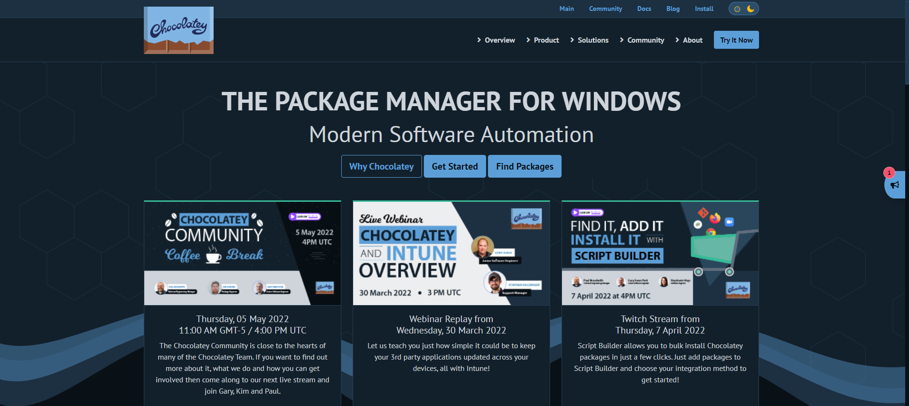
    </td>
  </tr>
</table>

<table>
  <tr>
    <td align="center" style="padding=0;width=50%;">
      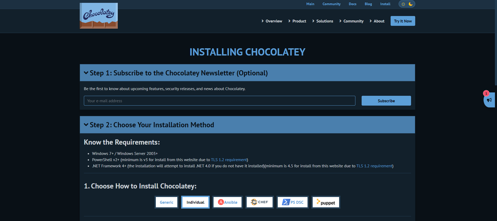
    </td>
  </tr>
</table>


```
Set-ExecutionPolicy Bypass -Scope Process -Force; [System.Net.ServicePointManager]::SecurityProtocol = [System.Net.ServicePointManager]::SecurityProtocol -bor 3072; iex ((New-Object System.Net.WebClient).DownloadString('https://community.chocolatey.org/install.ps1'))
```

## Install Dart

Install Dart Windows [dart.dev](https://dart.dev/get-dart)

<table align="center">
  <tr>
    <td align="center" style="padding=0;width=50%;">
      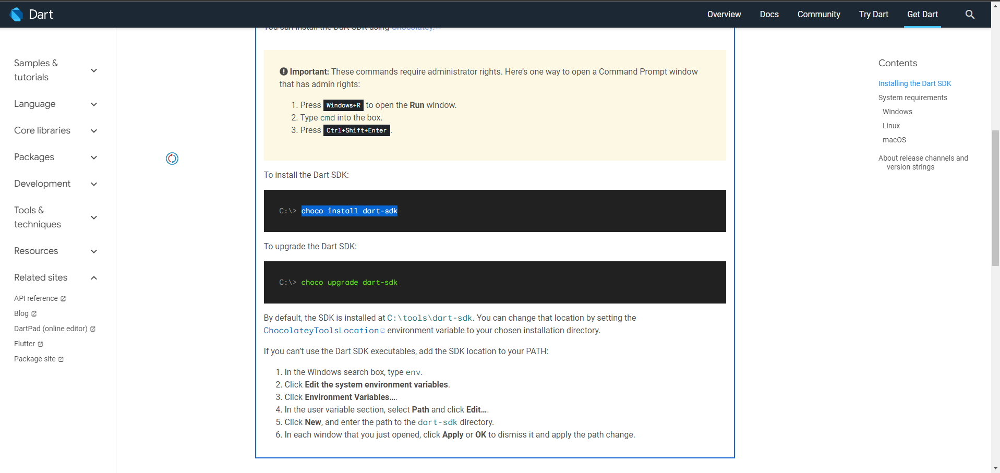
    </td>
  </tr>
</table>

```
choco install dart-sdk
```

```
choco upgrade dart-sdk
```

---

<br>
</br>
<p align="center">
  
</p>

[](https://bestpractices.coreinfrastructure.org/projects/5631)

Flutter is Google's SDK for crafting beautiful, fast user experiences for
mobile, web, and desktop from a single codebase. Flutter works with existing
code, is used by developers and organizations around the world, and is free and
open source.

Install Flutter Windows [flutter.dev](https://flutter.dev/get-started)

# The Flutter Framework

Install Fluttter for Windows [Download Flutter](https://docs.flutter.dev/get-started/install)

<table align="center">
  <tr>
    <td align="center" style="padding=0;width=50%;">
      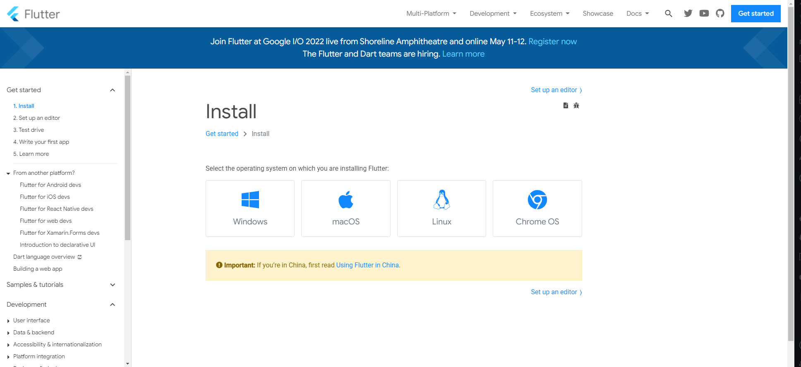
    </td>
  </tr>
</table>

<table align="center">
  <tr>
    <td align="center" style="padding=0;width=50%;">
      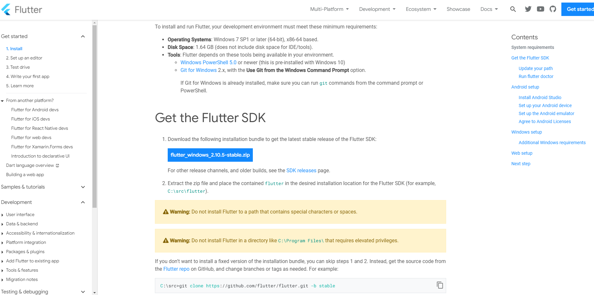
    </td>
  </tr>
</table>

<table align="center">
  <tr>
    <td align="center" style="padding=0;width=50%;">
      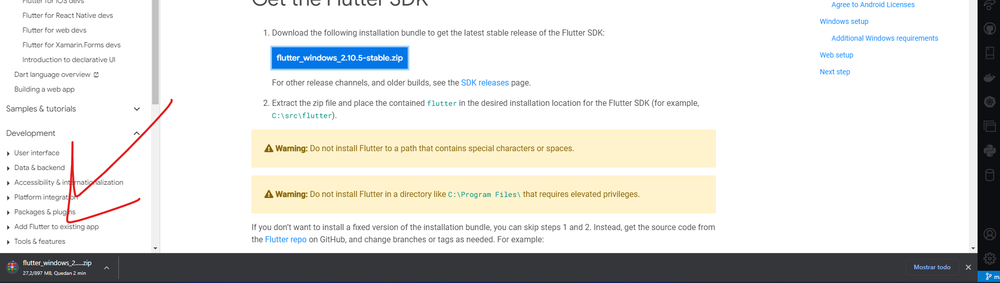
    </td>
  </tr>
</table>

## Config Flutter

* Insert into disk C

<table align="center">
  <tr>
    <td align="center" style="padding=0;width=50%;">
      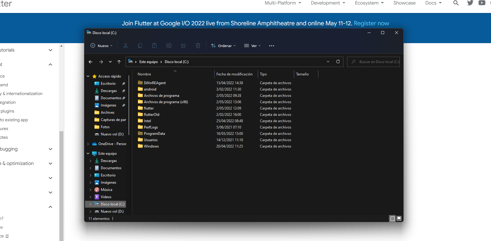
    </td>
  </tr>
</table>

* environment variables


<table align="center">
  <tr>
    <td align="center" style="padding=0;width=50%;">
      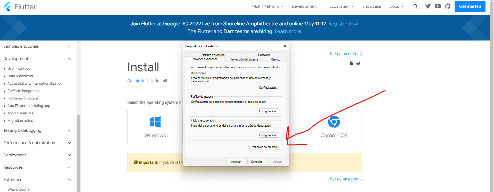
    </td>
  </tr>
</table>

* Add Path

<table align="center">
  <tr>
    <td align="center" style="padding=0;width=50%;">
      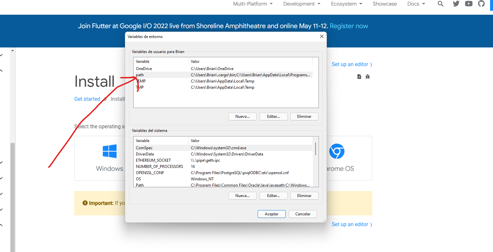
    </td>
  </tr>
</table>

** Add Item

<table align="center">
  <tr>
    <td align="center" style="padding=0;width=50%;">
      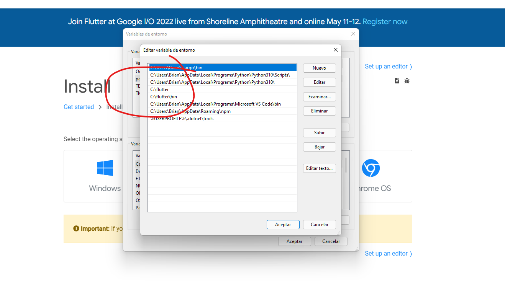
    </td>
  </tr>
</table>


## Visual Code Config

 * Add Dart Plugging

<table align="center">
  <tr>
    <td align="center" style="padding=0;width=50%;">
      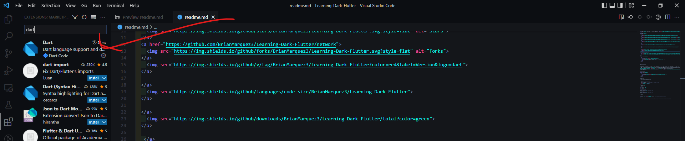
    </td>
  </tr>
</table>

 * Add flutter Plugging

 
<table align="center">
  <tr>
    <td align="center" style="padding=0;width=50%;">
      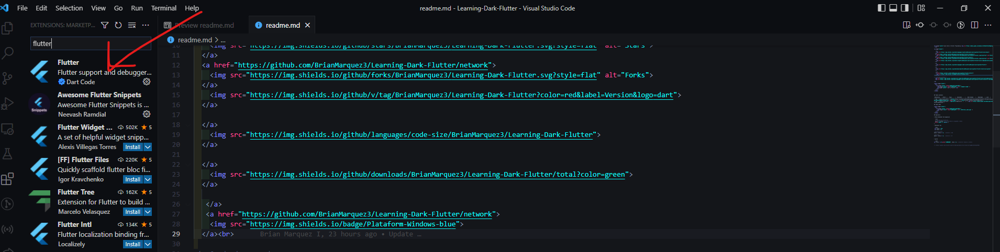
    </td>
  </tr>
</table>

## Final Config

<table align="center">
  <tr>
    <td align="center" style="padding=0;width=50%;">
      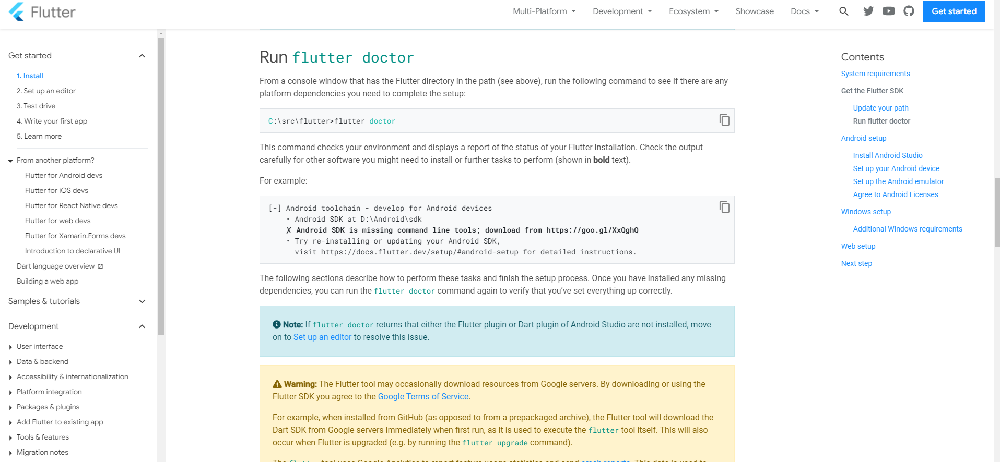
    </td>
  </tr>
</table>

https://docs.flutter.dev/get-started/install/windows#run-flutter-doctor

