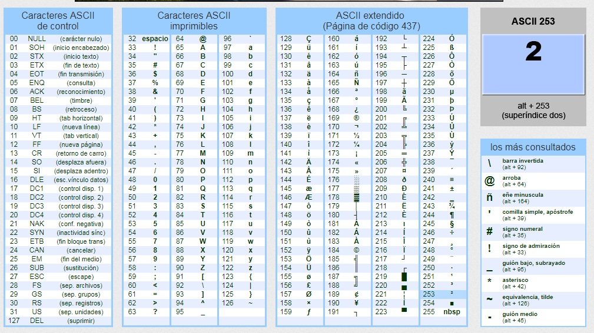
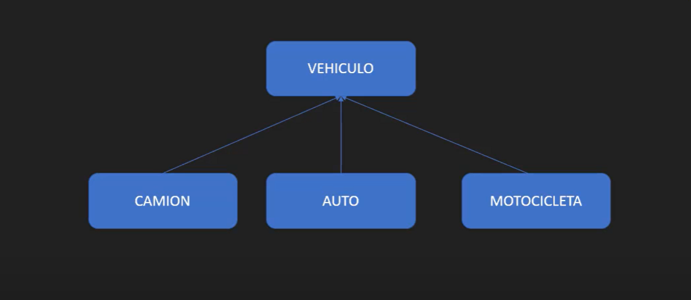
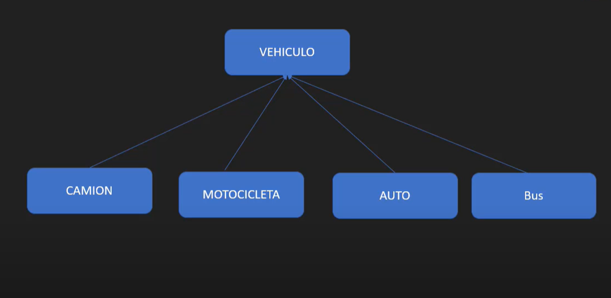
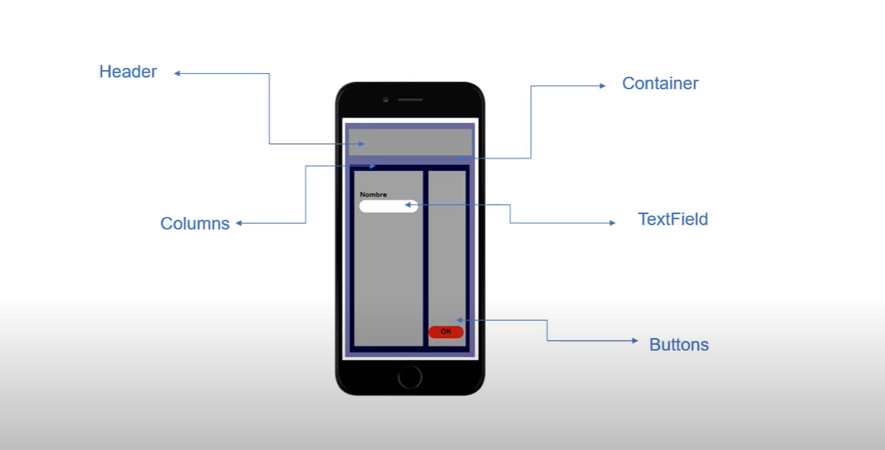
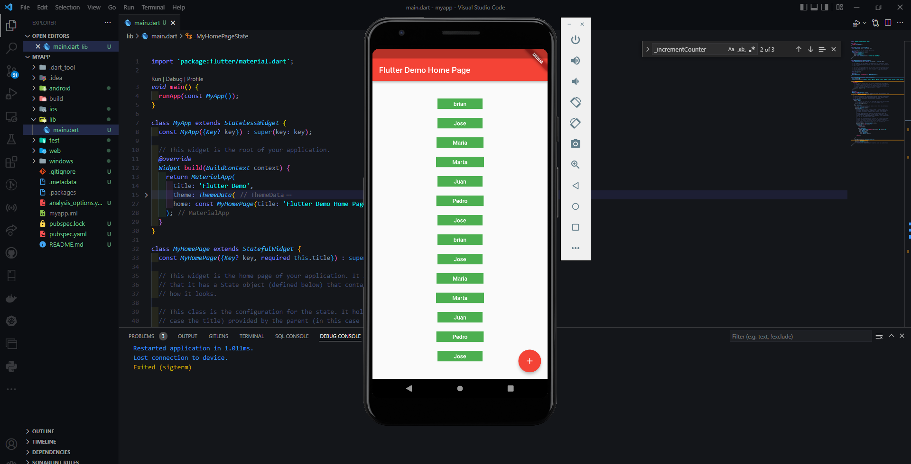
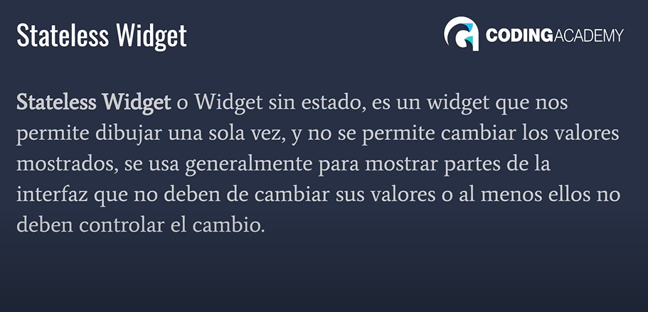
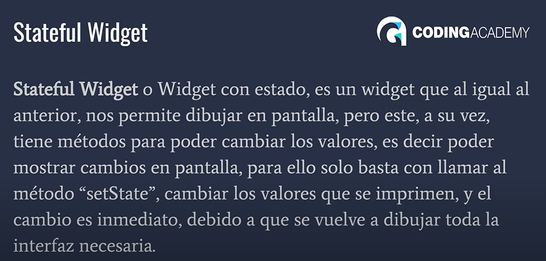
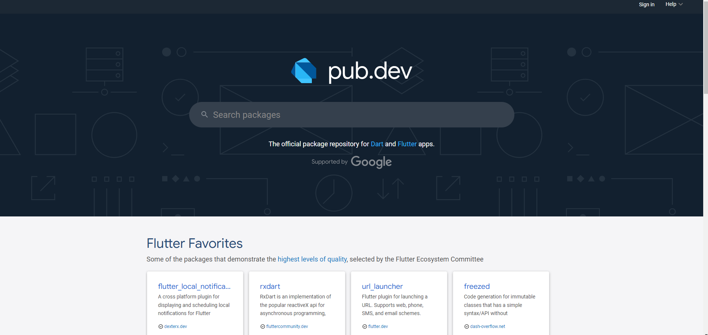
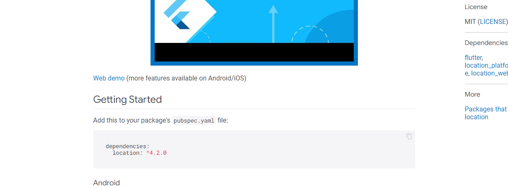
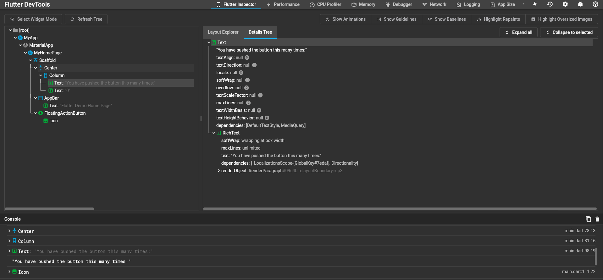

<h2 align="center">Learn Dark & Flutter Programming  Beginners Course
 </h2>

<p align="center">
  
   </a>
    
  </a>
  <a href="https://github.com/BrianMarquez3/Learning-Dark-Flutter/stargazers">
    
  </a>
  <a href="https://github.com/BrianMarquez3/Learning-Dark-Flutter/network">
    
  </a>
    
  </a>
  
  </a>
    
  </a>
  
  </a>
    
  </a>
  
   </a>
   <a href="https://github.com/BrianMarquez3/Learning-Dark-Flutter/network">
    
  </a><br>
 
<!--Cuadrados grandes-->
  
  
  
</p>
  
<table align="center">
  <tr>
    <td align="center" style="padding=0;width=50%;">
      
      <h4 align="center"> Dart & Flutter </h4>
    </td>
  </tr>
</table>
 
## Table Contents

 Numeration    | Check  |    Topic      |   Available      |    Edit Gitpot    |    Downloads    |  Link   |
| ------------ |--------|-------------- |----------------- |------------------ |---------------- |-------- |
|  001   |:heavy_check_mark: | [Install](https://github.com/BrianMarquez3/Learning-Dark-Flutter/tree/main/Install)  |   👍  | | 💾 | [ Atras](https://github.com/BrianMarquez3) | 
|  002   |:heavy_check_mark: | [Operators](#Operators)  |   👍  | | 💾 | [ Atras](https://github.com/BrianMarquez3) | 

## Table ASCI

<table align="center">
  <tr>
    <td align="center" style="padding=0;width=50%;">
      
    </td>
  </tr>
</table>

## Operators

* Nuevo Operador de Asignacion

```dart
  // Operador de asignacion
  data1 ~/= data2; // el resultado es asignado a data1
  print('data1 ->: $data1');
}
```
* Operador bit

```dart
 var data1 = 132;
 var data2 = 5;

//multiplicacion
data2 = data1 << 2;  //132*2*2 = 528

//division
data2 = data1 << 2;  //132/2/2 = 33
```

* parse

```dart
var value = int.parse("10000100", radix: 2); //convertir binario a entero
```

<!--https://giphy.com/stickers/LeCercle-Boxing-boom-cercle-lecercle-hsg8UlvI5sYa4oVFIW>-->

## POO

* Class

```dart
class vehiculo{

  late String color;
  late String modelo;
  late String marca;
}

```

* Ejemplo POO

```dart
class vehiculo{

  //Variables tardías
  late String color;
  late String modelo;
  late String marca;

  void Arrancar(){
    print("Arrancando Programacion orientada a objetos");
  }
  // primera funcion
  void CambiarValor(int numero){
    for(int i = 0; i<numero; i++){
      print("numero: $i");
    }
  }
  //segunda funcion
  void CambiarMarca(String marca){
    marca = marca;
    print(marca);
  }
}


void main(){
  var auto = new vehiculo();
  int numero = 10;

  auto.color = "Azul";
  auto.marca = "Toyota";
  auto.Arrancar();
  auto.CambiarValor(numero);
  auto.CambiarMarca("Ford");
}
```

* POO - Herencia

- Sobreescritura de metodos

```dart
 @override
 ```

<table align="center">
  <tr>
    <td align="center" style="padding=0;width=50%;">
      
    </td>
  </tr>
</table>

* POO clases Abtractas


<table align="center">
  <tr>
    <td align="center" style="padding=0;width=50%;">
      
    </td>
  </tr>
</table>

- Example

```dart
// INTERFASES
abstract class EsTransporte{
  void QueTranporteSoy();
}

// Implementar las interfaces (implements)
class Camion extends Vehiculo implements EsTransporte{
  @override
  void miCombustible() {
    print('Diesel');
  }
```


<<<<<<< HEAD
|Number| File                  | Link        |    Code     | Version     | Estado      | Atras       |
|:----:|-----------------------|:-----------:|:-----------:|:-----------:|:-----------:|:-----------:|
| -   | [clases Abtractas ](https://github.com/BrianMarquez3/Learning-Dark-Flutter/blob/main/interfaces.dart) |


<!--https://giphy.com/stickers/LeCercle-Boxing-boom-cercle-lecercle-hsg8UlvI5sYa4oVFIW>
=======
|Numeration  | File   |  Link       |    Folk     |  Code       | Version     | State       | Download    |  Go back    |
|:----------:|:------:|:-----------:|:-----------:|:-----------:|:-----------:|:-----------:|:-----------:|:-----------:|
|-       | [clases Abtractas ](https://github.com/BrianMarquez3/Learning-Dark-Flutter/blob/main/interfaces.dart)  | ✔️  | ✔️ | yes | yes | ✔️ | 💾 | [⬅️Atras](#https://github.com/BrianMarquez3) |
>>>>>>> b8172fde8c31c5f5cf1f4ce000f806cff08b4dfd

---

<table align="center">
  <tr>
    <td align="center" style="padding=0;width=50%;">
      
    </td>
  </tr>
</table>

[](https://bestpractices.coreinfrastructure.org/projects/5631)


Flutter is Google's SDK for crafting beautiful, fast user experiences for
mobile, web, and desktop from a single codebase. Flutter works with existing
code, is used by developers and organizations around the world, and is free and
open source. 

 - Arquitectura Flutter

<table align="center">
  <tr>
    <td align="center" style="padding=0;width=50%;">
      
    </td>
  </tr>
</table>

* Create new Project

  ```dart
  flutter create myapp
  ```

* Ver Emuladores

  ```dart
  flutter emulators --launch Machina_Virtual
  ```

  * Ejecutar Flutter

  ```dart
  flutter run
  ```

  * Ejemplo Flutter
  
<table align="center">
  <tr>
    <td align="center" style="padding=0;width=50%;">
      
    </td>
  </tr>
</table>

|Numeration  | File   |  Link       |    Folk     |  Code       | Version     | State       | Download    |  Go back    |
|:----------:|:------:|:-----------:|:-----------:|:-----------:|:-----------:|:-----------:|:-----------:|:-----------:|
|-       | [Ejemplo Flutter ](https://github.com/BrianMarquez3/Learning-Dark-Flutter/tree/main/myFlutter/myapp)  | ✔️  | ✔️ | yes | yes | ✔️ | 💾 | [⬅️Atras](#https://github.com/BrianMarquez3) |

* Stateless Widget

<table align="center">
  <tr>
    <td align="center" style="padding=0;width=50%;">
      
    </td>
  </tr>
</table>

* Stateful Widget

<table align="center">
  <tr>
    <td align="center" style="padding=0;width=50%;">
      
    </td>
  </tr>
</table>

* Pub Dev

Link: [pub.dev](https://pub.dev/)

<table align="center">
  <tr>
    <td align="center" style="padding=0;width=50%;">
      
    </td>
  </tr>
  
  <table align="center">
  <tr>
    <td align="center" style="padding=0;width=50%;">
      
    </td>
  </tr>
</table>


* Flutter DevTools

Flutter DevTools: [http://127.0.0.1:9100/](http://127.0.0.1:9100/)


 `Ctr +Ship + p`

- Ingresar Datos

<table align="center">
  <tr>
    <td align="center" style="padding=0;width=50%;">
      
    </td>
  </tr>
</table>

- Flutter DevTools

<table align="center">
  <tr>
    <td align="center" style="padding=0;width=50%;">
      
    </td>
  </tr>
</table>
